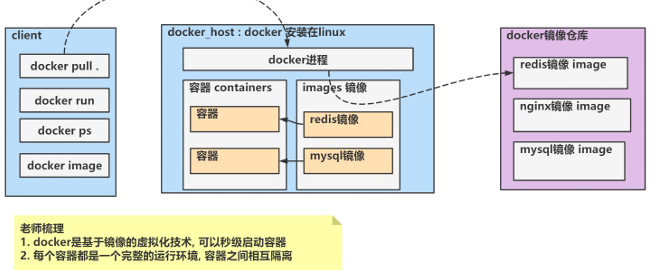

# 分布式项目落地

## 基础环境搭建

### Linux

```bash
# 查看虚拟机网路配置
ip a
```

### Docker



### 安装mysql

```bash
# 1. 拉去镜像
sudo docker pull mysql:5.7
# 2. 启动/创建容器
sudo docker run -p 3306:3306 --name mysql \
-v /mydata/mysql/log:/var/log/mysql \
-v /mydata/mysql/data:/var/lib/mysql \
-v /mydata/mysql/conf:/etc/mysql \
-e MYSQL_ROOT_PASSWORD=root \
-d mysql:5.7
# 3. 查看docker启动的容器执行情况
sudo docker ps
# 4. 验证启动的mysql容器是独立，可以视为一个独立的Linux系统
# 					容器名 进入到bash环境
sudo docker exec -it mysql /bin/bash	# 进入docker容器中的mysql环境
# 5. 登录mysql
mysql -u root -p
show databases;

sudo docker stop mysql	# 关闭容器，mysql为容器名
sudo docker start mysql	# 启动容器，重启restart
```

```bash
# 问题排查：sudo docker ps -a发现容器状态为exit(1)
sudo docker logs 容器id	# 查看日志排错
# mysqld: Can't read dir of '/etc/mysql/conf.d/' 原因是文件目录未创建
mkdir -p /mydata/mysql/conf/conf.d /mydata/mysql/conf/mysql.conf.d
```

一个镜像可以创建一个或多个容器，不同容器之间是相互独立的，监听的端口可以相同，但是linux虚拟机映射的端口不能相同，即`3306:3306`和`3307:3306`。

## 搭建产品发布系统-后端

[MySQL连接异常](https://blog.csdn.net/yunyala/article/details/132675032)

[parent.relativePath异常]([Maven pom中的parent.relativePath的作用（官网说明）-CSDN博客](https://blog.csdn.net/ipanyuhui/article/details/121531740))

> 子模块`<parent/>`的`relativePath`默认依赖`../pom.xml`即父项目/本地项目，而`springboot`默认都是直接从远程仓库拉去的，所以对于父项目指定`springboot`的需要加上`<relatePath/>`，从仓库获取

## 搭建产品发布系统-前端

## 创建家具分类表，并完成对家具分类增删改查功能

```mysql
CREATE DATABASE IF NOT EXISTS `hspliving_commodity`;
USE `hspliving_commodity`;
# 创建商品表
CREATE TABLE `commodity_category` (
 `id` BIGINT NOT NULL AUTO_INCREMENT COMMENT 'id',
 `name` CHAR(50) NOT NULL COMMENT '名称',
 `parent_id` BIGINT NOT NULL COMMENT '父分类id',
 `cat_level` INT NOT NULL COMMENT '层级',
 `is_show` TINYINT NOT NULL COMMENT '0不显示，1显示',
 `sort` INT NOT NULL COMMENT '排序',
 `icon` CHAR(255) NOT NULL COMMENT '图标',
 `pro_unit` CHAR(50) NOT NULL COMMENT '统计单位',
 `pro_count` INT NOT NULL COMMENT '商品数量',
 PRIMARY KEY(`id`)
)CHARSET=utf8mb4 COMMENT='商品分类表';
# 测试数据
INSERT INTO `commodity_category`(`id`, `name`, `parent_id`, `cat_level`, `is_show`, `sort`, `icon`, `pro_unit`, `pro_count`) 
VALUES (1, '家用电器', 0, 1, 1, 0, '', '', 0);
INSERT INTO `commodity_category`(`id`, `name`, `parent_id`, `cat_level`, `is_show`, `sort`, `icon`, `pro_unit`, `pro_count`) 
VALUES (21, '大家电', 1, 2, 1, 0, '', '', 0);
INSERT INTO `commodity_category`(`id`, `name`, `parent_id`, `cat_level`, `is_show`, `sort`, `icon`, `pro_unit`, `pro_count`) 
VALUES (22, '厨卫大电', 1, 2, 1, 0, '', '', 0);
INSERT INTO `commodity_category`(`id`, `name`, `parent_id`, `cat_level`, `is_show`, `sort`, `icon`, `pro_unit`, `pro_count`) 
VALUES (201, '燃气灶', 22, 3, 1, 0, '', '', 0), (202, '油烟机', 22, 3, 1, 0, '', '', 0);
INSERT INTO `commodity_category`(`id`, `name`, `parent_id`, `cat_level`, `is_show`, `sort`, `icon`, `pro_unit`, `pro_count`) 
VALUES (301, '平板电脑', 21, 3, 1, 0, '', '', 0);
# 第2组 家具家装
INSERT INTO `commodity_category`(`id`, `name`, `parent_id`, `cat_level`, `is_show`, `sort`, `icon`, `pro_unit`, `pro_count`) 
VALUES (2, '家居家装', 0, 1, 1, 0, '', '', 0);
INSERT INTO `commodity_category`(`id`, `name`, `parent_id`, `cat_level`, `is_show`, `sort`, `icon`, `pro_unit`, `pro_count`) 
VALUES (41, '家纺', 2, 2, 1, 0, '', '', 0);
INSERT INTO `commodity_category`(`id`, `name`, `parent_id`, `cat_level`, `is_show`, `sort`, `icon`, `pro_unit`, `pro_count`) 
VALUES (601, '桌布/罩件', 41, 3, 1, 0, '', '', 0);
INSERT INTO `commodity_category`(`id`, `name`, `parent_id`, `cat_level`, `is_show`, `sort`, `icon`, `pro_unit`, `pro_count`) 
VALUES (602, '地毯地垫', 41, 3, 1, 0, '', '', 0);
INSERT INTO `commodity_category`(`id`, `name`, `parent_id`, `cat_level`, `is_show`, `sort`, `icon`, `pro_unit`, `pro_count`) 
VALUES (42, '灯具', 2, 2, 1, 0, '', '', 0);
INSERT INTO `commodity_category`(`id`, `name`, `parent_id`, `cat_level`, `is_show`, `sort`, `icon`, `pro_unit`, `pro_count`) 
VALUES (651, '台灯', 42, 3, 1, 0, '', '', 0);
INSERT INTO `commodity_category`(`id`, `name`, `parent_id`, `cat_level`, `is_show`, `sort`, `icon`, `pro_unit`, `pro_count`) 
VALUES (652, '节能灯', 42, 3, 1, 0, '', '', 0);
```

